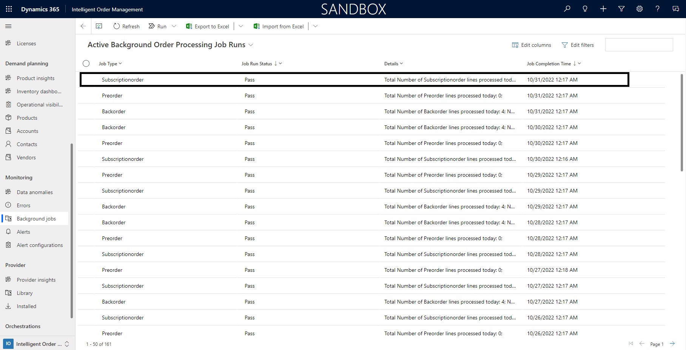

# Manage subscription orders

[!include [banner](includes/banner.md)]

This article describes how to manage subscription orders in Microsoft Dynamics 365 Intelligent Order Management.

Intelligent Order Management can handle subscription orders, and therefore gives customers the flexibility to have their orders regularly fulfilled. The order frequency is specified at the product level.

Through appropriate subscription order management, retailers can gain the following benefits:

- Increased customer loyalty and a strong customer base
- Predictable recurring revenue
- Better cash flow management

## Turn on subscription order functionality

To get started with subscription management, you must first turn on the subscription order functionality.

To turn on subscription order functionality, follow these steps.

1. In the left navigation pane, select **Settings**, and then select **General app settings**.
1. Select **Order handling preferences**, and then select **Manage**.
1. Set the **Subscription Orders** option to **On**.

    

## Specify the subscription frequency 

For each subscription order that is started in Intelligent Order Management, you must specify the subscription frequency.

To specify the subscription frequency at the product level, follow these steps.

1. In the left navigation pane, select **Demand Planning**, and then select **Products**.
1. Select the product to specify the subscription frequency for.
1. Select **Allowed Subscription Frequency**, and then select **Monthly**, **Quarterly**, **Yearly**, or **Select All**. The subscription order product is then validated for the eligible fulfillment frequency.
1. Select **Save** or **Save & Close**.

## How subscription order management works

A subscription order can be created either in an e-commerce application or through a customer service representative in Intelligent Order Management. Both methods create a subscription order under **Orders** in Intelligent Order Management.

The following table describes the subscription order fields.

| Field name | Description |
| ---- | ----------- |
| Fulfillment Frequency | The product frequency that was set up in **Products**. This value initiates the subscription fulfillment job.|
| Current Subscription | The current recurrence of the subscription. The value is an integer that reflects the current subscription number.|
| Subscription Start Date | The start date for the subscription. |
| Subscription End Date | The end date for the subscription, if the customer specified an end date. |
| Last Ordered Date | The date when the last order was created. This field is automatically set. |

> [!NOTE]
> Currently, one product per subscription is supported. Support for multiple-product subscription will be available in later releases.

After a subscription order is created in Intelligent Order Management, based on the product frequency that the customer selected, a background job automatically picks up the orders and generates sales orders from the subscription. The sales orders then follow the order orchestration and generate fulfillments accordingly.

A job log that is available shows a list of job runs, their status, and the number of records that have been successfully processed and moved to fulfillment. To access the job log, in the left navigation pane, select **Monitoring \> Background Jobs**. The **Active Background Order Processing Job Runs** page appears, as shown in the following example image.

If a background job fails, you can manually run it. Select **Run** on the upper toolbar, and then select **Subscription-Order Job** to start a new instance of the background job. To view the details of the background job run, select the job line.
