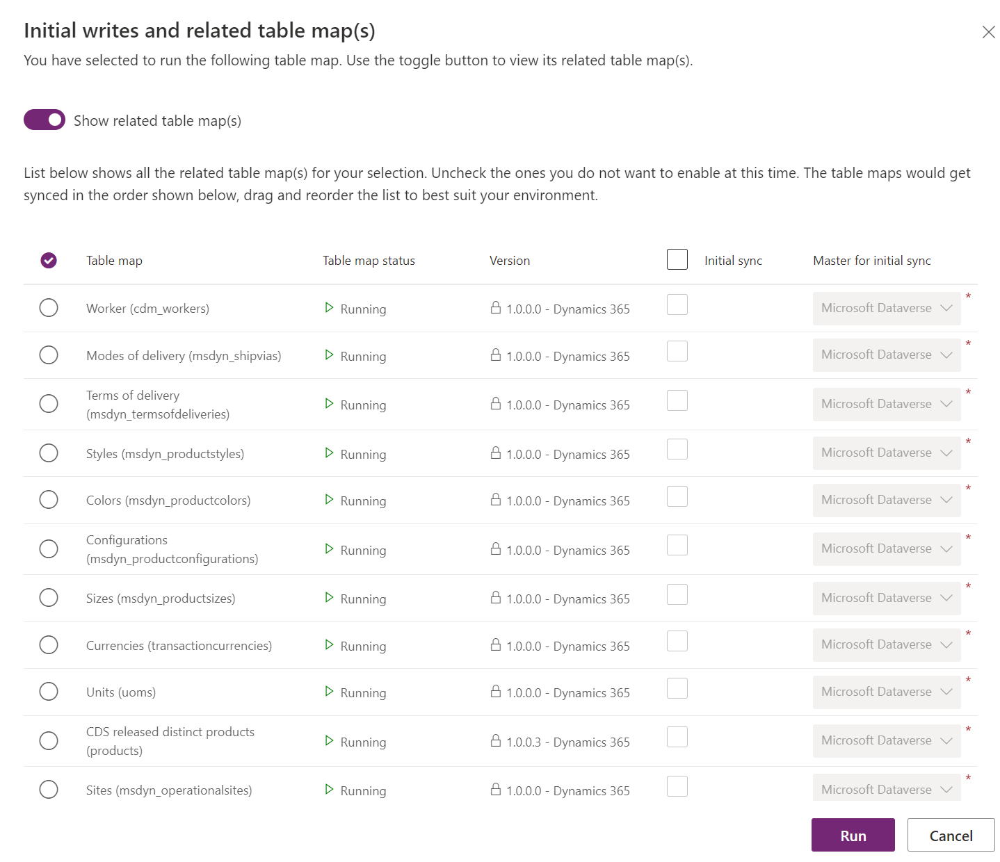
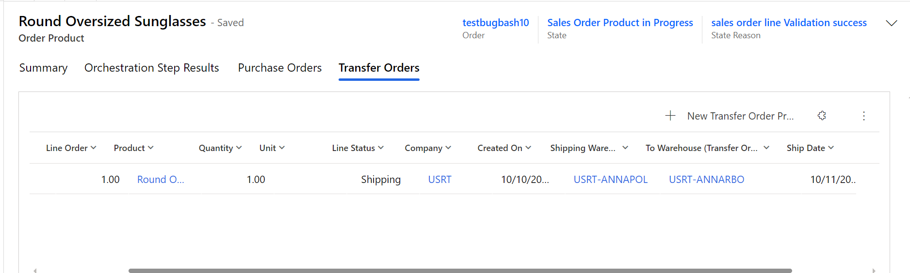

# Integrate Supply Chain Management transfer orders with Intelligent Order Management

[!include [banner](includes/banner.md)]

This article describes how to integrate transfer orders in Microsoft Dynamics 365 Supply Chain Management with Microsoft Dynamics 365 Intelligent Order Management.

A transfer order is created by warehouse workers to transfer products from one warehouse or location to another. Some of the common reasons for transfer orders include (but aren't limited to) the following:
- Transfer of products from manufacturing to a distribution facility.
- Stock replenishment at a store from a distribution center.
- Ad hoc transfers to a warehouse from another warehouse to meet a spike in demand.
- Transfers between warehouses for service purposes such as packaging and customizing requirements.

As part of extending support and providing visibility to the enterprise transactions, a **Transfer Order** entity has been introduced in Dynamics 365 Intelligent Order Management. The **Transfer Order** entity includes the following features:
- Dual-write support for transfer orders is available, so that transfer order data flows seamlessly from Microsoft Dataverse into Intelligent Order Management and is visible in real time, or near real time.
- Creation of transfer orders in Intelligent Order Management that will be processed in Supply Chain Management with dual-write support.
- The user interface (UI) fields for the **Transfer Orders** entity have been designed to support sales order fulfillment scenarios.
- Transaction status and visibility of transfer orders from Supply Chain Management are available directly in Intelligent Order Management.
- The **Transfer Order products** view is available on the **Sales Order** products tab, which provides visibility to the transfers from individual transfer order transactions.

## Dual-write support for transfer orders

The following prerequisites must be met before you can activate dual-write support for transfer orders:

- Install or update the following dual-write packages to ensure that you have the latest versions:
    - Dual-write core solution package
    - Dual-write Application Core package
    - Dual-write Finance package
    - Dual-write Human Resources package
- If your environment already has dual-write for sales orders installed, ensure that it is up to date.
- If an older version of Intelligent Order Management is running in your instance, and dual-write is already installed there, ensure that you import the user experience (UX) solution package for purchase orders and transfer orders.

## General guidelines for installing the add-on UX package for new users

- If you're installing Intelligent Order Management first, you should install the dual-write solution before you import the UX package solution.
- If you're installing the dual-write solution first, the UX package solution will be imported as part of the installation. You can then install Intelligent Order Management.

## Initial synchronization of prerequisite tables

After all the preceding prerequisites have been met, before you can create new transfer orders and work with existing transfer orders you must first synchronize the reference data between Supply Chain Management and Dataverse. You use the initial write functionality to detect the table relationships and find the tables that you must enable for a given map.

In the dual-write sync settings, you will see the prerequisite tables for both **Transfer Order Headers** and **Transfer Order Products** table maps.

The following tables must be synched for the **Transfer Order Header** table map.

- Sites
- Worker
- Modes of delivery
- Terms of delivery
- Warehouses

The following tables must be synched for the **Transfer Order Products** table map.

- Worker
- Modes of delivery
- Terms of delivery
- Styles
- Colors
- Configurations
- Sizes
- Currencies
- Units
- CDS released distinct products
- Sites
- Warehouses

For more information about dual-write mapping references, see [Dual-write mapping reference](/fin-ops-core/dev-itpro/data-entities/dual-write/mapping-reference).

## Create a transfer order 

To create a transfer order, follow these steps.

1. In the left navigation pane, select **Orders \> Transfer orders**. 
1. Select **+New**. 
1. Enter values for the following mandatory fields: 

    1. **Name** to specify a transfer order ID (which should be the same ID used in Supply Chain Management).
    1. **Company**.  
    1. **From warehouse** to specify the warehouse to transfer from, and **To warehouse** to specify the warehouse to transfer to. 
    1. Optionally, enter a **Ship date** value if you know when the transfer will ship out, and a **Receive date** value specifying when it will be received. These two optional fields can also be left blank.
1. To create a transfer order product, select **New Transfer Order product**, and then enter values for **Product**, **Line number**, and **Transfer quantity**. If you see that several other fields are locked, this means that those values are populated from Supply Chain Management as part of dual-write synchronization.
1. If you entered a **Ship date** and a **Receive date** on the header, those values are populated by default to the lines and can be overridden.
1. Select **Save**. Once **Transfer Order Products** is saved, it will sync to Supply Chain Management to be processed further.

## Process transfer order and status updates.

As transfer orders process in Supply Chain Management, the status updates are reflected via dual-write in Dataverse and become visible in Intelligent Order Management. When a transfer order gets shipped, the status is updated to **Shipped** on the header and lines. The **Shipped Quantity** value is reflected on the **Transfer Order product** form. When the transfer order is received in Supply Chain Management, the status is updated to **Received** on the header. The **Line Status** value is set to **None** after the item is received.

## View of Transfer Order Products within Sales Order Products

A view of transfer orders is available via a tab on the sales order product form.  The **Transfer Orders** tab shows the list of transfers for the order product, including values for the **Shipping Warehouse** and **To Warehouse**. This tab provides visibility into incoming inventory for the assigned warehouse to the sales order product. 

