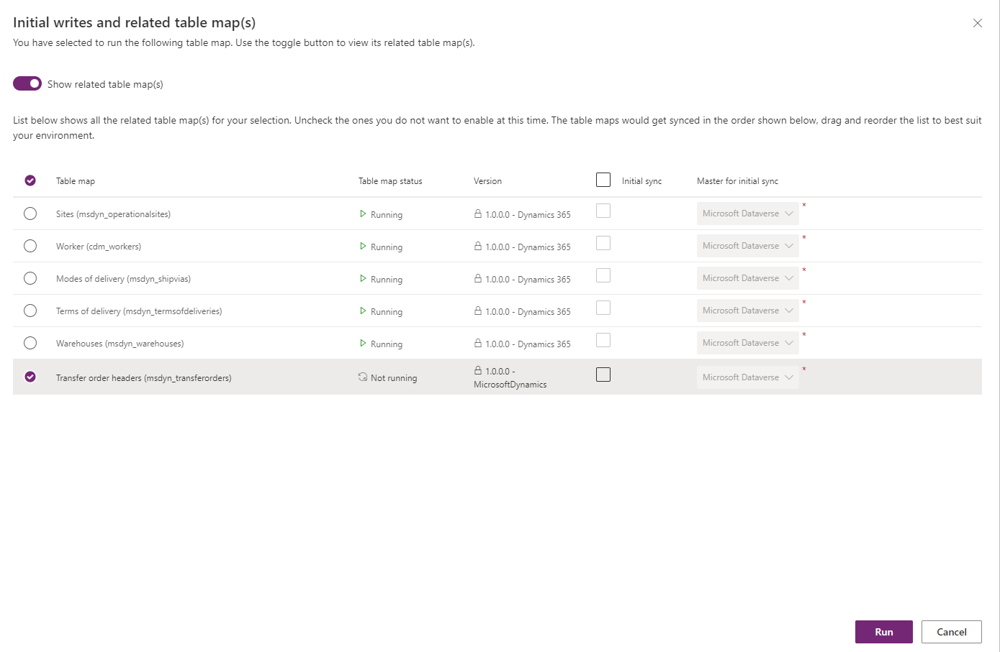

# Integrate Transfer Order in Supply Chain Management with Intelligent Order Management

[!include [banner](includes/banner.md)]

This article describes how to integrate Transfer Order in Microsoft Dynamics 365 Supply Chain Management with Microsoft Dynamics 365 Intelligent Order Management.

**Transfer order** is created by warehouse workers to transfer products from one warehouse or location to another. Some of the common reasons for a **Transfer Order** include but aren't limited to the following:
- Transfer products from manufacturing to a distribution facility.
- Stock replenishment at a store from a distribution center.
- Ad hoc transfers to a warehouse from another warehouse to meet the spike in demand.
- Transfers between warehouses for service purposes such as packaging and customizing requirements.

This topic describes how to integrate **Transfer Orders** in Microsoft Dynamics 365 Supply Chain Management with Microsoft Dynamics 365 Intelligent Order Management.

As part of extending support and providing visibility to the enterprise transactions, a **Transfer Order** entity has been introduced in Dynamics 365 Intelligent Order Management.
The feature support the following:
- Dual-write support for **Transfer Orders** is available so that Transfer order data seamlessly flows from Microsoft Dataverse into Intelligent Order Management and is visible in real or near real time.
- Creation of **Transfer Orders** in Intelligent Order Management. This will be processed in Supply Chain Management with dual-write support.
- **Transfer Order** entity user interface fields have been designed to meet the specific needs of support for sales order fulfillment scenarios.
- Transaction status and visibility of **Transfer orders** from Supply Chain Management is directly available to view within Intelligent Order Management.
- The **Transfer Order product** view is available within the **Sales Order products** tab, which provides visibility to the transfers from individual **Transfer order** transactions

## Dual-write support for **Transfer Orders**

The following prerequisites must be met to activate dual-write support for purchase orders:

It's important to have the following dual-write packages installed or updated to ensure that you have the latest versions.
- Dual-write core solution package
- Dual-write Application Core package
- Dual-write Finance package
- Dual-write Human Resources package

If your environment already has dual-write for sales orders installed, ensure that it is up-to-date.
If you have an older version of Intelligent Order Management running in your instance, which already has dual-write installed, ensure that you import the UX solution package for Purchase Orders and Transfer Orders.

## General guidelines for installing the add-on UX package for new users

If you are installing Intelligent Order Management first, you should install the dual-write solution before importing the UX package solution.
If you are installing the dual-write solution first, the UX package solution will be imported as part of the install. Intelligent Order Management can then be installed afterwards.

## Initial sync of pre-requisite tables

To create new **Transfer orders** and work with existing **Transfer orders**, you must sync the reference data between Supply Chain Management and Dataverse. You use the initial write functionality to detect the table relationships and find the tables that you must enable for a given map.
In the dual-write synch settings you will see the pre-requisite tables for both **Transfer Order Header** and **Transfer Order Products**
Following tables need to be synched for header.

- Sites
- Worker
- Modes of delivery
- Terms of delivery
- Warehouses

Following tables need to be synched for products

- Worker
- Modes of delivery
- Terms of delivery
- Styles
- Colors
- Configurations
- Sizes
- Currencies
- Units
- CDS released distinct products
- Sites
- Warehouses

For dual-write mapping reference refer [Dual-write mapping reference.](/fin-ops-core/dev-itpro/data-entities/dual-write/mapping-reference)

## Create **Transfer Order** 

1. To create **Transfer Order** go to the site map entry **Transfer orders** under **Orders**
1. Select **+New** and enter mandatory fields such as **Name** to denote a **Transfer order** id (which would be the same id in Supply Chain Management).
   **Company**, **From Warehouse** to denote the transfer from and the **To warehouse** to denote the transfer to warehouse. Also enter **Ship date** if you know when    the transfer will ship out and **Receive date** as to when it will be received. These two are optional fields that can also be left blank.  
1. To create **Transfer Order Product** select **New Transfer Order product** enter **Product** , **Line number** and **Transfer quantity**. You will notice that
   several other fields are locked which would mean those data would be populated from Supply chain management as part of dual-write sync.
1. If you entered a **Ship date** and **Receive date** on the header, they would default to the lines and can be overridden on the lines.
1. Once the **Transfer Order Products** is saved, it will sync to Supply Chain Management to be processed further.

## Processing of Transfer Order and Status updates.

As **Transfer Order** processes in Supply Chain Management the status updates are reflected via dual-write in Dataverse and becomes visible in Intelligent Order Management. When **Transfer Order** gets shipped, the status of **Shipped** is updated on the header and lines. **Shipped Quantity** is reflected on the **Transfer Order product** form. When the **Transfer Order** is received in supply chain management, the status of **Received** is updated on the header. The Line status reflects as **None** after the item is received.

## View of Transfer Order Products within Sales Order Products

A view of **Transfer orders** is available inside the **sales order product**  within a separate tab showing the list of Transfers for the order product along with the **shipping** and **receiving warehouse**. This would give visibility of incoming inventory for the assigned warehouse to the sales order product. 

