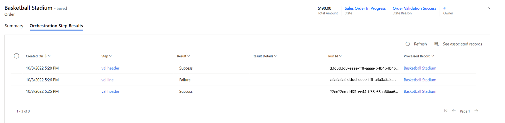

# Error handling and troubleshooting

[!include [banner](includes/banner.md)]

This article provides an overview of error handling and troubleshooting in Microsoft Dynamics 365 Intelligent Order Management.

Dynamics 365 Intelligent Order Management has five primary error handling screens that you can use to diagnose issues with your environment. Each error handling screen provides different information based on the type of error.

## Entity-specific orchestration step results

For entities such as sales order and fulfillment order, you can select the **Orchestration Step Results** tab to see information about every step that has executed for that record, and the orchestration result.

<!---->

The following table lists the **Orchestration Step Results** tab fields and their descriptions.

|**Field**|**Description**|
|:-|:-|
|**Created On**|When the step ran.|
|**Step**|Step in the orchestration journey. Selecting this field takes you to the step result, and you can use this view to see results across all entities.|
|**Result**|Success/Failure|
|**Result Details**|If the step passed back an execution result value message, it will appear here. |
|**Run Id**|Power Automate Run ID|
|**Processed Record**|Which record this step ran on.|

## System errors

You can get a view of errors in the system for four different error types:

- Provider inbound
- Provider action
- Orchestration step
- Policy

To access these error pages, select **Monitoring \> Errors** on the left navigation pane to get to the **Error pages** screen, as shown in the following illustration.

<!---->

### Provider inbound errors

**Provider inbound** errors are used to monitor Power Automate flows that handle data ingestion. These types of errors can be triggered either from a polling (scheduled) mechanism, or a webhook that an external system calls into.

The fields available on this form will help you diagnose errors with these inbound providers.

The following table lists the **Provider inbound** error fields and their descriptions.

|**Field**|**Description**|
|:-|:-|
|**Time of Error**|When the error occurred.|
|**Error Status**|The status of the error. You can deactivate an error to hide it from this page.|
|**Provider**|Which provider the error belongs to.|
|**Provider Message Handler**|The message handler that failed.|
|**Message Id**|An ID given to a message to uniquely identify it.|
|**Error Message**|The error message returned.|
|**Error Category**|Category of the error.|
|**Run History URL**|A link to the Power Automate flow that ran.|

### Provider action errors

**Provider action** errors are associated with outbound calls from Intelligent Order Management to a provider action. You can use this page to determine if the same provider is failing multiple times across the system. Such errors might indicate that something is wrong with a specific provider.

The following table lists the **Provider action** error fields and their descriptions.

|**Field**|**Description**|
|:-|:-|
|**Created On**|When the failure occurred.|
|**Result**|Success / Failure|
|**Provider Action**|Which provider action failed.|
|**Step Execution Result**|Which step the error is associated with.|
|**Processed Record**|Which record was processed for this failure.|
|**Result Details**|If the flow returned an execution result, it would be displayed here.|
|**Run History URL**|The Power Automate flow run that failed.|

### Orchestration step errors

**Orchestration step** errors show orchestration steps that have failed across the system, and are used to determine if there's a systemic issue across runs. <!--For more information about these errors, see Entity Specific Orchestration Step Results.-->

### Policy errors

Use the **Policy Errors** page to find all the policy and/or rule failures in your system. 

The following table lists the **Policy** error fields and their descriptions.

|**Field**|**Description**|
|:-|:-|
|**Created On**|When the policy failure occurred|
|**Result**|Should be False|
|**Policy**|Which policy failed|
|**Step Execution Result**|The step that failed|
|**Processed Record**|Which record failed|
|**Result Details**|If an error message was returned the details of that error message|

## Troubleshoot Power Query transformation failures

When a call to Intelligent Order Management Provider Transformer fails, the best way of debugging these failures is to directly observe the power automate execution.

To directly observe the power automate execution, follow these steps.

1. Navigate to the Power Platform portal for your environment.
1. Open **Solutions \> Default Solution**.
1. Search for the cloud flow **IOM Provider Transformer**.

    

1. Open the cloud flow and examine the 28 day run history.

    

1. Find your execution and open it.
1. Expand **Try Process**. Depending on your version of Intelligent Order Management, you may need to expand to find the call to **Transform Data**.

    

1. If successful, you can view the result of the transformation directly. If an exception error is thrown, the exception details can be seen by showing the raw outputs of the call.

### Example errors

The following table lists example error messages and the suggested steps to fix the errors.

|**Error Message**|**Suggested Steps**|
|:-|:-|
|**Failed to retrieve a matching provider transformation record**|The provider ID must match an **Active Provider Instance**, not a provider definition. Your source object and destination object on the transformation must match what is shown on your call to Intelligent Order Management Provider Transformer.|
|**Field ‘field\_name’ was not found on the table**|You are accessing data that has no value provided in the record. You must use **Record.FieldOrDefault** if data is optional and you need a default value.|
