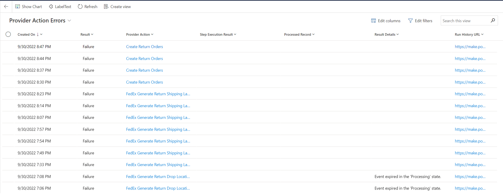
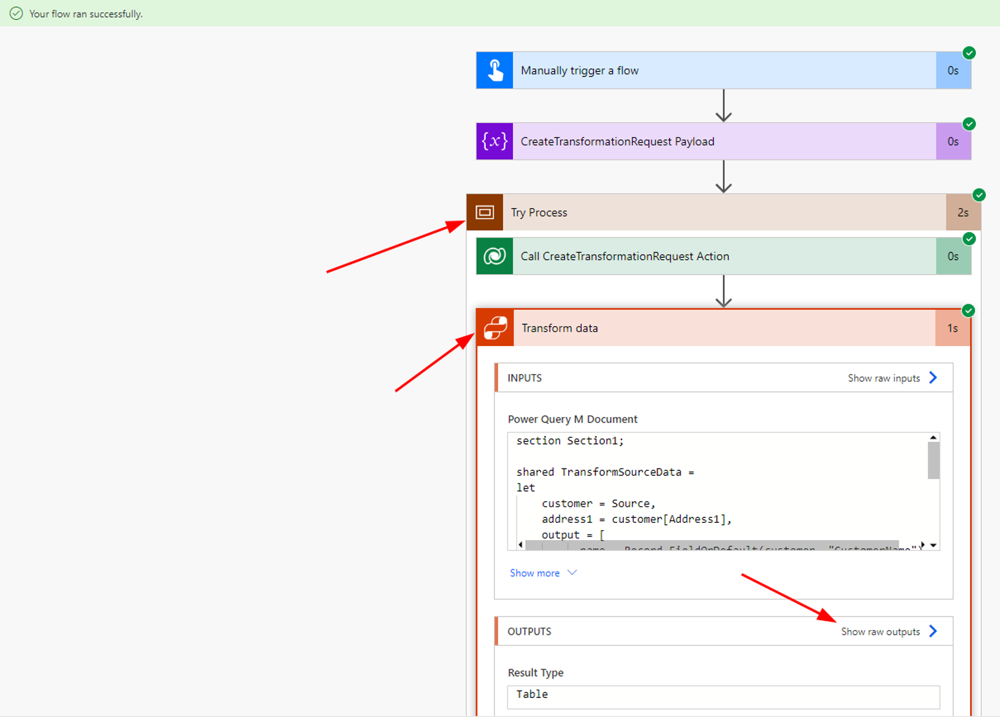

# Error Handling and Troubleshooting
Dynamics 365 Intelligent Order Management has five primary error handling screens that you can use to diagnose issues with your environment. Each error handling screen will give you different information based on the type of error.

## Entity Specific Orchestration Step Results
On entities such as the Sales order, Fulfillment order, etc. you'll find a tab labeled **Orchestration Step Results** which will give you information about every step that has executed for that record, and its outcome.

You can use the fields above to get information on the step that ran and its result

|**Field**|**Description**|
| :- | :- |
|**Created On**|When the step ran|
|**Step**|Step in the Orchestration journey. Clicking on this field will take you to the step result, and you can use this view to see results across all entities|
|**Result**|Success/Failure|
|**Result Details**|If the step passed a message back in Execution Result value of flow it would populate here|
|**Run Id**|Power Automate Run ID|
|**Processed Record**|Which record this step ran on|

## System Errors
You can get a view of errors in the system for four different error types

1. Provider inbound
1. Provider action
1. Orchestration step
1. Policy

To reach these pages, first navigate to **Monitoring > Errors** on the left navigation pane.

### Provider inbound errors
Provider inbound errors page is used to monitor power automate flows that handle data ingestion. The errors can be triggered either from a polling (scheduled) mechanism, or a webhook that an external system calls into.

The fields available on this form will help you diagnose errors with these inbound providers

|**Field**|**Description**|
| :- | :- |
|**Time of Error**|When the error occurred|
|**Error Status**|If the error is still Active. You can deactivate an error to hide it from this page|
|**Provider**|Which provider the error belongs to|
|**Provider Message Handler**|The Message handler that failed|
|**Message Id**|An ID given to a message to uniquely identify it|
|**Error Message**|The error message returned|
|**Error Category**|Category of the error|
|**Run History URL**|A link to the power automate flow that ran|

### Provider action errors
These errors are associated to outbound calls from Dynamics 365 Intelligent Order Management to a Provider action. You would use this page to determine if the same provider is failing multiple times across the system. These errors might be an indication that something is wrong with a specific provider.

The following fields will help you diagnose the error

|**Field**|**Description**|
| :- | :- |
|**Created On**|When the failure occurred|
|**Result**|Success / Failure|
|**Provider Action**|Which provider action failed|
|**Step Execution Result**|Which step the error is associated with|
|**Processed Record**|Which record was processed for this failure|
|**Result Details**|If the flow returned an execution result, it would be displayed here|
|**Run History URL**|The power automate flow run that failed|

### Orchestration Step
All orchestration steps that have failed across the system. Used as a single source of determining if there's a systemic issue across runs. For more information about these errors, see Entity Specific Orchestration Step Results

### Policy
Use this page to find all policy/rule failures in your system. 

The following fields can be used to help diagnose the failure

|**Field**|**Description**|
| :- | :- |
|**Created On**|When the policy failure occurred|
|**Result**|Should be False|
|**Policy**|Which policy failed|
|**Step Execution Result**|The step that failed|
|**Processed Record**|Which record failed|
|**Result Details**|If an error message was returned the details of that error message|

## Troubleshooting Power Query Transformation Failures

When a call to IOM Provider Transformer fails, the best way of debugging these failures is by looking at the execution of the power automate directly

1. Navigate to your Power Platform portal for your environment
1. Open Solutions > Default Solution
1. Search for the cloud flow “IOM Provider Transformer”

1. Open it, and look at the 28 day run history

1. Find your execution and open it

1. Expand Try Process. Depending on your version of IOM, you may need to expand to find the call to Transform Data.

1. If successful, you can view the result of the transformation directly. If an Exception is thrown, the exception details can be seen by showing the raw outputs of the call.

### Example Errors

|**Error Message**|**Suggested Steps**|
| :- | :- |
|**Failed to retrieve a matching provider transformation record**|The Provider ID must match an **Active Provider Instance** not a Provider Definition. Your Source Object and Destination Object on the transformation must match what is shown on your call to IOM Provider Transformer|
|**Field ‘field\_name’ was not found on the table**|You are accessing data that has no value provided in the record. You need to use Record.FieldOrDefault if data is optional and you need to default a value|
