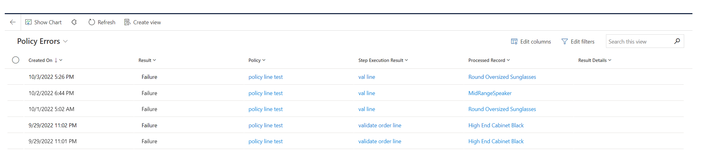
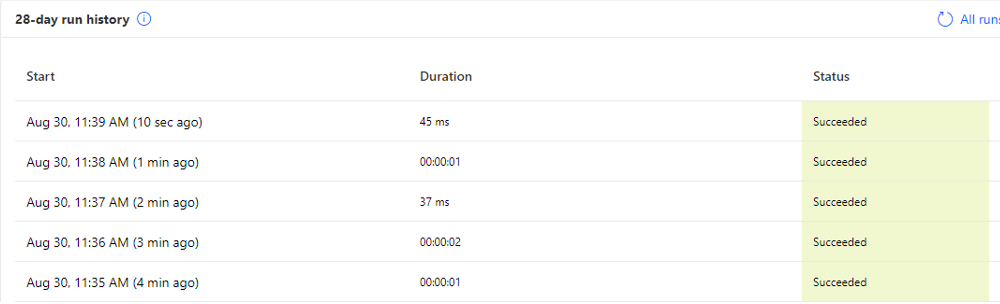

# Error handling and troubleshooting

[!include [banner](includes/banner.md)]
[!include [banner](includes/preview-banner.md)]

This article describes error handling and troubleshooting in Microsoft Dynamics 365 Intelligent Order Management.

Dynamics 365 Intelligent Order Management has five primary error handling pages that you can use to diagnose issues with your environment. Each error handling page provides different information, based on the type of error.

## Entity-specific orchestration step results

For entities such as sales orders and fulfillment orders, you can select the **Orchestration Step Results** tab on the order page to view information about every step that has run for that record, and the orchestration result.

The following table describes the fields on the **Orchestration Step Results** tab.

| Field | Description |
|---|---|
| Created On | The date and time when the step ran. |
| Step | The step in the orchestration journey. If you select the value in this field, you're taken to the step result, where you can view results across all entities. |
| Result | The result: either **Success** or **Failure**. |
| Result Details | Any execution result value message that the step returned. |
| Run ID | The Power Automate run ID. |
| Processed Record | The record that the step ran on. |

## System errors

You can view system errors for four error types:

- Provider inbound
- Provider action
- Orchestration step
- Policy

To access the error pages for these error types, select **Monitoring \> Errors** in the left navigation pane to open the **Error pages** landing page. Then select **Manage** for a specific error type.

### Provider inbound errors

Provider inbound errors are used to monitor Power Automate flows that handle data ingestion. These types of errors can be triggered from either a polling (scheduled) mechanism or a webhook that an external system calls into. The fields on the **Provider Inbound Errors** page can help you diagnose errors with inbound providers.

The following table describes the fields on the **Provider Inbound Errors** page.

| Field | Description |
|---|---|
| Time of Error | The date and time when the error occurred. |
| Error Status | The status of the error. You can deactivate an error so that it doesn't appear on this page. |
| Provider | The provider that the error belongs to. |
| Provider Message Handler | The message handler that failed. |
| Message ID | An ID that is assigned to a message to uniquely identify it. |
| Error Message | The error message that was returned. |
| Error Category | The category of the error. |
| Run History URL | A link to the Power Automate flow that ran. |

### Provider action errors

Provider action errors are associated with outbound calls from Intelligent Order Management to a provider action. You can use this page to determine whether the same provider is failing multiple times across the system. These errors might indicate that something is wrong with a specific provider.

The following table describes the fields on the **Provider Action Errors** page.

| Field | Description |
|---|---|
| Created On | The date and time when the failure occurred. |
| Result | The result: either **Success** or **Failure**. |
| Provider Action | The provider action that failed. |
| Step Execution Result | The step that the error is associated with. |
| Processed Record | The record that was processed for this failure. |
| Result Details | Any execution result that the flow returned. |
| Run History URL | The Power Automate flow run that failed. |

### Orchestration step errors

The **Orchestration Step Errors** page shows orchestration steps that have failed across the system. You can use it to determine whether there's a systemic issue across runs. For more information about these errors, see the [Entity-specific orchestration step results](#entity-specific-orchestration-step-results) section earlier in this article.

### Policy errors

You can use the **Policy Errors** page to find all the policy and rule failures in your system.

The following table describes the fields on the **Policy Errors** page.

| Field | Description |
|---|---|
| Created On | The date and time when the policy failure occurred. |
| Result | The result. The value should always be **Failure**. |
| Policy | The policy that failed. |
| Step Execution Result | The step that failed. |
| Processed Record | The record that failed. |
| Result Details | The details of any error message that was returned. |

## Troubleshoot Power Query transformation failures

If a call to Intelligent Order Management Provider Transformer fails, the best way to debug the failure is to directly observe the Power Automate execution.

1. Open the Power Platform portal for your environment.
1. Go to **Solutions \> Default Solution**.
1. Search for the **IOM Provider Transformer** cloud flow, and open it.
1. Review the information in the **28 day run history** grid.

    

1. Find the execution that you're interested in, and open it.
1. Expand **Try Process**. Depending on your version of Intelligent Order Management, you might have to expand further to find the call to **Transform data**.
1. If the process is successful, you can view the result of the transformation directly. If an exception error is thrown, you can view the exception details by selecting **Show raw outputs** to show the raw outputs of the call.

    

### Example errors

The following table shows some examples of error messages and describes the suggested steps to fix the errors.

| Error message | Suggested steps |
|---|---|
| Failed to retrieve a matching provider transformation record. | The provider ID must match an *active provider instance*, not a provider definition. The source object and destination object on the transformation must match what is shown in your call to Intelligent Order Management Provider Transformer. |
| Field "field\_name" was not found on the table. | You're trying to access data that no value is provided for in the record. If data is optional, you must use **Record.FieldOrDefault** as a default value. |

## Reprocess orchestration errors

If a sales order fails in orchestration step, it can be reprocessed from the failed step using the "Reprocess" button from the top ribbon.

## Troubleshoot Dual-write errors

If a sales order or sales order lines fail while being processed through Dual-write into Finance and operations, following places show the errors.

The out of box provider action that is used to send an order to FinOps shows **Failed** in the **Orchestration step results**. The result details show the error message from Dual-write for order header failures.

If one or more sales order lines fail during Dual-write processing, the resulting Dual-write error message will be surfaced in a new field **Sync error** on the sales order line in Dataverse and also available in the UI out of the box in IOM.

### Filter order without lines in Dual-write

If a sales order doesn't have any sales order lines, the order will be filtered from synching through Dual-write to avoid errors in the downstream processing. The error message will be surfaced in orchestration step results in IOM.

