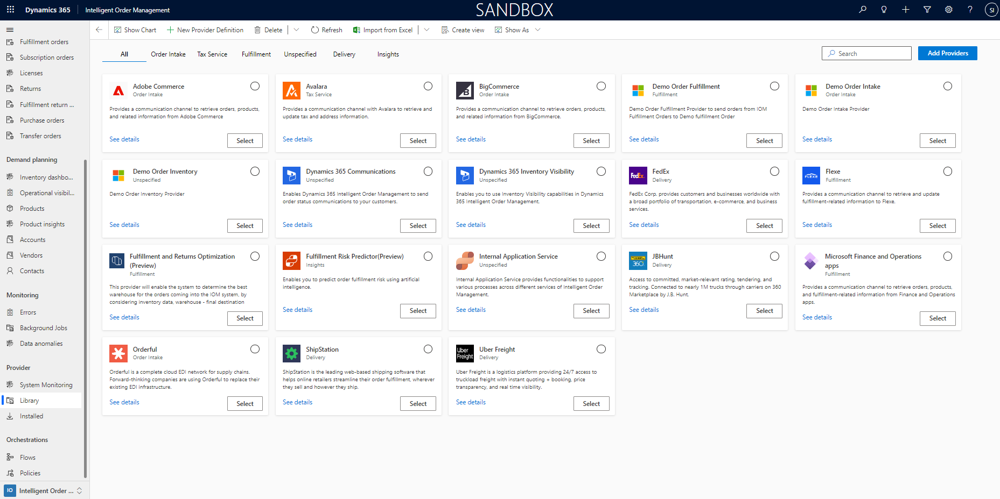
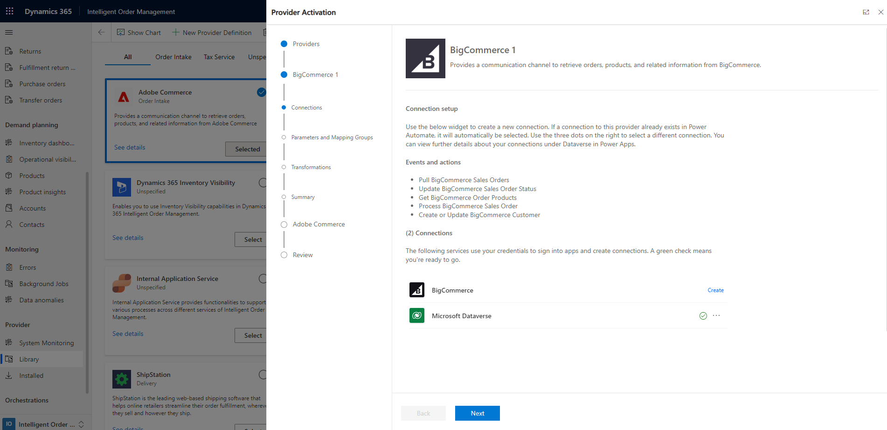

---

author: sumanic
description: This article provides an overview of the process of working with providers and explains how to set up a provider in Microsoft Dynamics 365 Intelligent Order Management.
ms.date: 03/21/2025
ms.custom: 
  - bap-template
ms.topic: how-to
ms.author: sumanic

title: Work with providers

---

# Work with providers

[!include [banner](includes/banner.md)]
[!include [banner](includes/preview-banner.md)]

This article provides an overview of the process of working with providers and explains how to set up a provider in Microsoft Dynamics 365 Intelligent Order Management.

A key value proposition of Dynamics 365 Intelligent Order Management is the ability to integrate seamlessly with other systems. To achieve this integration, Intelligent Order Management uses *providers*. Providers are constructs that let you connect Intelligent Order Management to external systems.

Intelligent Order Management includes a library of out-of-box providers that you can set up and customize to meet your needs. You can also create your own provider if the library doesn't have the one that you need. 

The following illustration shows an example of providers in the Intelligent Order Management provider library.

## Provider architecture

Intelligent Order Management providers were designed with the following properties:

- **Extensibility** – Providers can be extended and customized by using Microsoft Power Platform.
- **Low code customization** – Because providers are built on Microsoft Power Platform, customizations require little to no code.
- **Scale** – Providers use Power Automate so that they can scale up with the volume of incoming messages.

## Provider components

A provider in Intelligent Order Management has the following components.

| Component name | Description | For more information |
|-------------------------|-------------------------|-------------------------|
| Connection | The connection component in Intelligent Order Management enables a provider to establish a connection with an external service. Each provider instance might require one or more connections that it uses to gain access to and communicate with the external service. Some provider instances might not require any connections. For more information, see [Learn to connect to your data using connections and on-premises data gateways.](/power-automate/add-manage-connections#delete-a-connection) | <ul><li>
Go to **Provider \> Library** or **Provider \> Installed**, and select the provider that you want to find the connection information for.

On the **Overview** tab, the **Connections** section lists all the dependent connections.
</li></ul> |
| Business Event | The events that are defined for a provider are events that the associated provider actions can raise in the orchestration designer. All the out-of-box business events in Intelligent Order Management can be applied for all providers. | <ul><li>
Go to **Provider \> Library** or **Provider \> Installed**, and select the provider that you want to find the business event information for.

The **Event** tab has two sections: **Global Events** and **Provider Events**. The **Global Events** section lists the events that are provider-agnostic. The **Provider Events** section lists the events that are provider-specific.
</li></ul> |
| Action | The actions that are associated with a provider determine what actions are available to you when you create an orchestration flow. If your provider doesn't have any actions, the provider can't be invoked from the orchestration. | <ul><li>
Go to **Provider \> Library** or **Provider \> Installed**, and select the provider that you want to find the action information for.

The **Actions** tab lists all the actions that are provider-specific. The list of provider actions is also available at **Providers \> Provider Actions**.
</li></ul> |
| Parameter | Some providers require additional configuration information to retrieve and send information. This additional information is referred to as a *provider parameter*. | <ul><li>
Go to **Provider \> Library** or **Provider \> Installed**, and select the provider that you want to find the parameter information for.

The **Parameters** tab lists the provider parameters.
</li></ul> |
| Transformation | Provider transformations are essential to any provider that retrieves or sends data from Intelligent Order Management to an external service. A transformation maps data from an external service to an entity in Intelligent Order Management, and from Intelligent Order Management to an external source. For more information, see [What is Power Query?](/power-query/power-query-what-is-power-query) | <ul><li>
Go to **Provider \> Library** or **Provider \> Installed**, and select the provider that you want to find the transformations for.

The **Transformations** tab lists the provider-specific actions. The list of transformations is also available at **Providers \> Transformations**.
</li></ul> |

## Activate one or more providers 

Follow these steps to set up one or more providers.

1. Go to **Providers \> Library**.
1. Select **Select**, or select the symbol next to the provider that you want to set up. If you want to set up multiple providers, repeat this step for each additional provider.
1. Select **Activate Provider** in the upper right.
1. In the wizard for adding the connections, read the terms and conditions, and select the checkbox for each provider that you selected.
1. Select **Accept** to accept the terms and conditions.
1. For the first provider, select **See details** to open the **Provider Activation** page. There, you can optionally edit the provider name or leave it as it appears on the **Connection** page.

    

1. Scroll down to the **Connections** section to view the connections that are associated with the provider.
1. Next to the provider connection, select **Create** to open a page where you can enter the connection details.
1. Enter the connection details, and then select **Create**. When the connection has been added, a green check mark appears next to it.
1. Add the **Microsoft Dataverse** connection. This connection should automatically be referenced from your system connections, and a green checkmark should appear next to it.
1. When you've successfully added the connections, select **Next**.
1. On the **Parameters** page, add any parameters that are required for the provider.
1. Select **Mapping Group**.
1. Select **Next**.
1. On the **Transformations** page, review the details, and make any changes that are required.
1. Select **Next**.
1. On the **Summary** page, review the added connections and their details.
1. Select **Activate**. You receive the following message: "Provider activated successfully."
1. Select **Back** to make any updates.
1. Select **Next** for any additional providers that you selected.
1. Repeat steps 6 through 20 for each additional provider.
1. When you've finished configuring the providers, go to the **Review and Finish** page.
1. Review the details, and close the wizard. Any providers that haven't yet been activated will be shown as **Installed** in gray. Providers that have been successfully activated with be shown as **Activated** in green.

## Delete a provider instance

When you delete a provider instance, the system removes any configuration you completed for that provider. None of the information you set up is saved, including the connection details, transformations, and any customizations.

Before you delete a provider instance, ensure that you aren't using the provider in any of your orchestration flows.

To delete a provider instance, follow these steps.

1. Remove any related provider actions from your orchestration flows. Dependent flows will break if you delete a provider without removing the related steps.
1. Go to **Provider \> Installed**.
1. Select the provider that you want to delete, and then select **Delete**.
1. Optional: If you want to remove connections to your external service in this environment, delete the connections that you set up as a part of this provider in Power Automate. To remove a connection, follow the steps in [Learn to connect to your data using connections and on-premises data gateways.](/power-automate/add-manage-connections#delete-a-connection).

## Additional resources

[Set up an environment](setup.md)

[Provider catalog](provider-catalog.md)

[Customize an out-of-box provider](customize-provider.md)

[Create a new provider](create-new-provider.md)

[Intelligent Order Management architecture](architecture.md)
